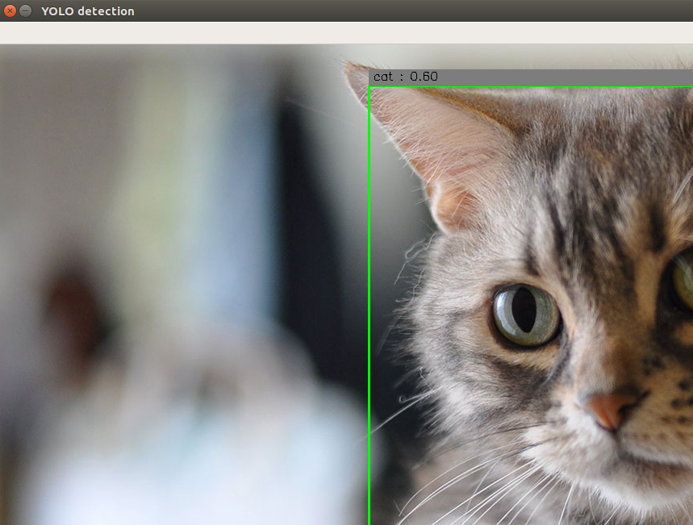

=====================================================================
Movidius で YOLO(Caffe) を試す方法
=====================================================================

YoloNCSを試してみます。

試す環境としては、先のUbuntu16.04の仮想環境(ncsdkのexamplesが動いた状態)を想定して進めていきます。

◇YoloNCSをダウンロード
--------------------------------------------------

::

    git clone https://github.com/gudovskiy/yoloNCS.git

YoloNCSのReadmeに使い方が書いてありますが、コマンド等が更新されている為、本記事を参考に試してみてください。

◇Yolo(Caffe)モデルをダウンロード
--------------------------------------------------

::

    cd yoloNCS/py_examples

Googleドライブよりダウンロード(仮想環境の人は仮想環境内でブラウザを立ち上げるか、ファイルを共有してもらう)

https://drive.google.com/file/d/0Bzy9LxvTYIgKNFEzOEdaZ3U0Nms/view?usp=sharing

yoloNCS/py_examples にコピーします。

◇Caffe ModelをNCS用にでコンパイル
--------------------------------------------------

yoloNCS/py_examples ディレクトリに居ることを想定して

::

    mvNCCompile -w yolo_tiny.caffemodel -s 12 ../prototxt/yolo_tiny_deploy.prototxt 

を実行。するとpy_examplesディレクトリに graphが出来ます。

◇Yolo (Caffe)を試してみる
-------------------------------------------------

yoloNCS/py_examples ディレクトリに居ることを想定して

::

    python3 yolo_example.py ../images/dog.jpg

:note: 何度か失敗しますがドライバー周りの問題なので、何回か試すとうまく行く時がある

上手くいくと、以下の図が起動するはず・・・

.. image:: ../img/YOLOv1Caffe/dogafter.PNG
    :width: 480px

できました！

◇他の画像を試してみる
-------------------------------------------------

今回試したYOLOが認識できるワードは

["aeroplane", "bicycle", "bird", "boat", "bottle", "bus", "car", "cat", "chair", "cow", "diningtable", "dog", "horse", "motorbike", "person", "pottedplant", "sheep", "sofa", "train","tvmonitor"]

の２０種類だけですが、最新のYOLOv2になると９０００種類の認識が出来るそうです。

YOLOv2はCaffeに対応していないので、次のTensorFlowで試したいと思いますが、面白いのでこのまま画像認識されます。

遊び方としては

python3 yolo_example.py <画像ファイル>

といった感じで、画像際るのアドレスを張ればＯＫそうなので

Googleを使って猫画像を拾ってきます。

::

    wget http://tgs.jp.net/wp-content/uploads/2016/12/12.jpg

    python3 yolo_example.py 12.py

面白い。

◇試してみて思う事
-------------------------------------------------

後日まとめます。

******************************************************************
管理情報
******************************************************************
:著者: 北神 雄太(Yuta Kitagami)
:連絡先: kitagami@Artifactnoise.com
:公開日: 2017/10/27

