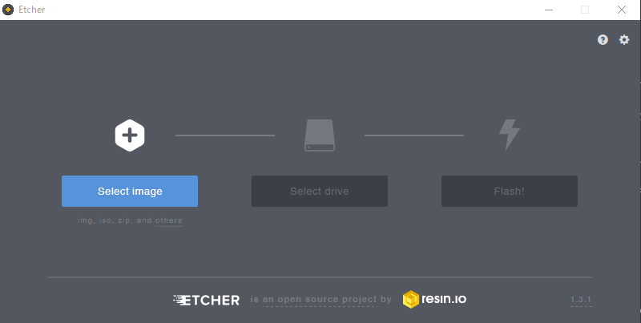
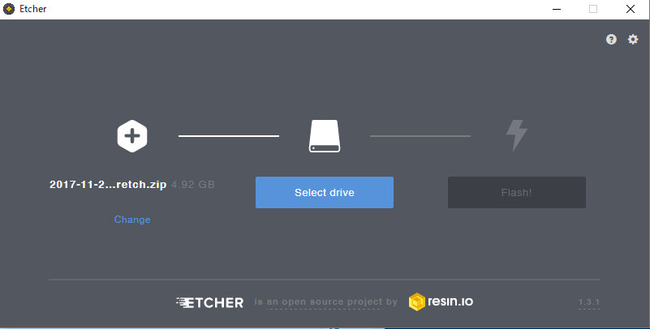
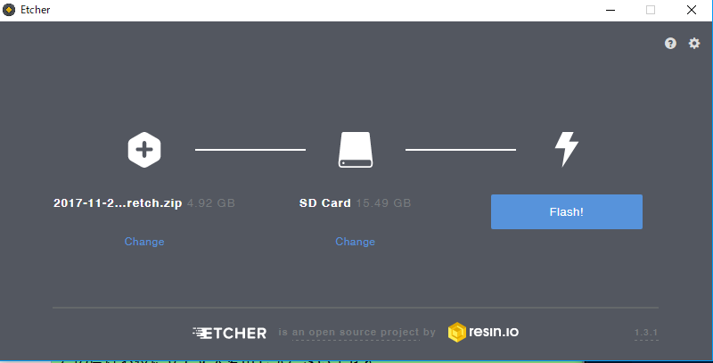
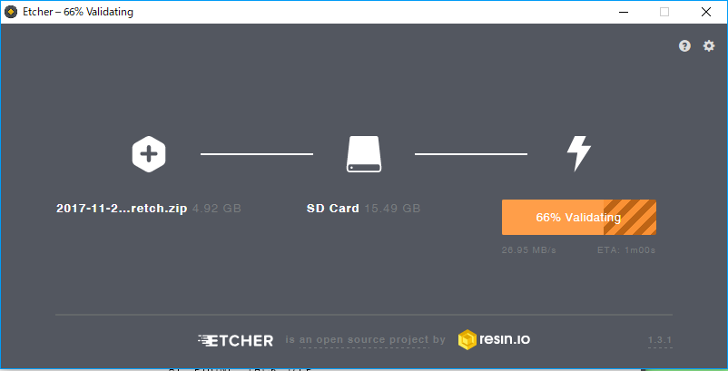
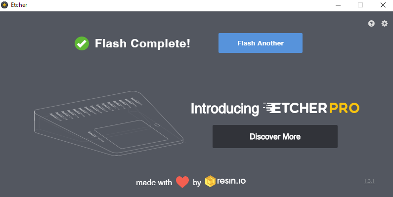
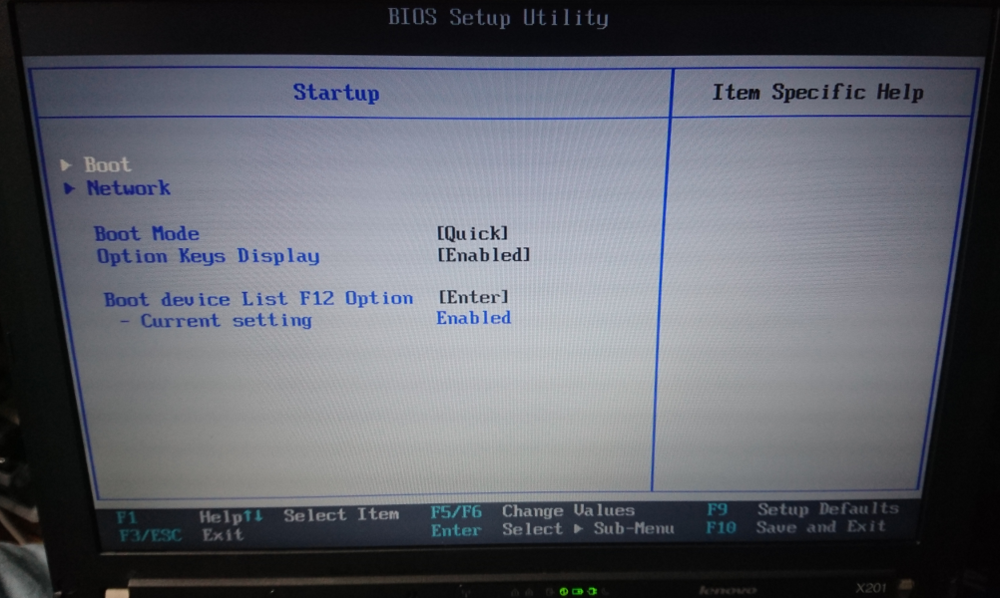
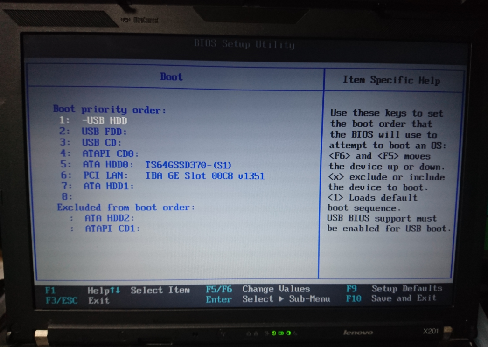

=====================================================================
Lenovo X201 で始める Movidius
=====================================================================

0.はじめに
--------------------------------------------------------------------

Movidiusが発売されて数カ月、タンスの肥やしになってたMovidiusを久しぶりに触りたく、
同じくタンスの肥やしになっていたX201にUbuntuをインストールしてMovidius専用開発機を作ろうと思いました。

勿論、X201以外にX230やX240も動くと思いますが、ここは愛を込めてX201として話を進めていきます。

◇購入方法（Amazon.jp）
--------------------------------------------------

.. raw:: html
    
    <iframe style="width:120px;height:240px;" marginwidth="0" marginheight="0" scrolling="no" frameborder="0" src="https://rcm-fe.amazon-adsystem.com/e/cm?ref=qf_sp_asin_til&t=movidius-22&m=amazon&o=9&p=8&l=as1&IS2=1&detail=1&asins=B074PRCJKH&linkId=53b6aac9df8648ee07ad45ce6f96f282&bc1=000000&lt1=_blank&fc1=333333&lc1=0066c0&bg1=ffffff&f=ifr">
    </iframe>

1.準備するもの
--------------------------------------------------------------------

- USBメモリ 16GB (フォーマットしても良いもの)

- Movidius

- Lenovo X201 ※

※ MovidiusはUbuntuでしか動作しないため、X201にWindowsが入っている際はフォーマットされます。
※ 本書はX201をUbuntu開発機にしても問題ない方限定です。

2.Ubuntuのイメージファイルをダウンロードする。
--------------------------------------------------------------------

MovidiusはUbuntu x86_64 に対応した環境か、Raspberry Pi 3Bの様なボードに対応している。

勿論Raspberry Pi 3Bを使う方が大多数と思われるが、メインで開発をするのにRaspberry Pi 3Bを元に行うとか物凄く面倒！

そんな事なので、今回家でたまたま眠ってた X201を使ってMovidius専用開発環境の構築を行う。

今回使用するのは、Ubuntu x86_64 (amd64)(64ビットモデル) です。

- Ubuntu 

https://www.ubuntu.com/desktop

- Xbuntu

https://xubuntu.org/download

著者はメインでXbuntuを使用しています。

試しにLinux MINT で試しましたが、OS Checkでエラーになりました。Xbuntuにします。

Movidiusの公式には　Ubunt 16.04と書いてありますが、記事を書いた時点では Ubuntu 18.04でも動作することが分かりました。

なるべく最新のものをオススメしたいので、今回はUbunt 18.xx を元に説明していきます。

☆ 今回使ったISOファイル　直リンク

http://ubuntutym2.u-toyama.ac.jp/xubuntu/18.04/release/xubuntu-18.04-desktop-amd64.iso

これからUSBブートを作成します。

3.USBブート用のUSBメモリーを作成する
--------------------------------------------------------------------

USBブート用のUSBメモリーを作成するソフトは、

今回は説明の都合、Windows,Mac,Linuxで動作するEtcherを使用します。

    https://etcher.io/

自分に合わせたＯＳ選択し、ダウンロードします。

インストール後にEtcherを起動します。

以下の様な画面が出ますので 「Select image」をクリックし、先ほどダウンロードしたISOを選択します。

続いて「Select drive」を選択します。そこでどのドライブにしますか？と聞かれますので、USBメモリを選択します。

すると、以下のような状態になり、再度確認を行い、問題が無いようでしたら「Flash!」をクリックします。

以下のように進捗バーが進み、うまく行くと終了と図のようになります。

終了後、USBメモリを抜き、X201のUSBポートへ接続します。

4.X201でUSB-Bootを行う
--------------------------------------------------------------------

X201のUSBポートにUSBメモリを接続し、X201の電源を入れます。

その際、OSが立ち上がる前の以下の画面の時に、F1を押し、BIOS設定にします。

.. image:: ../img/X201/01.png

以下の様な画面になり、十字キーの下を押し、「Srartup」を選択し、Enterを押します。

.. image:: ../img/X201/02.png

すると、以下のような画面になり、Bootの所でEnterを押します。

次に Boot priority order:　の項目で　USB HDD を上位に持っていき、1.USB HDDとしたいので、

USB HDDに十字キーで選択し、F6をクリックして上に移動していきます。

ちなみに、下に下げるときはF5です。

1.USB HDDとなれば、起動時にUSBメモリが認識されUSBメモリに書き込まれたイメージファイルが立ち上がります。

変更した内容を保存して再起動します。　F10を押し、保存してよいかを聞かれますのでYesをEnterし、再起動します。

もしここでUSBメモリを接続してない事に気がついた際は、X201の電源を一度落とし、USBを指してから電源を入れると同様にUSBメモリから起動するはずです。

後は通常のUbuntのインストール方法と同じです。ここでは割愛します。

:参考サイト: https://qiita.com/SUZUKI_Masaya/items/fbc10d437788dd95ad0d
 
5.Ubuntu(Xubuntu)でMovidiusを動かす。
--------------------------------------------------------------------

さて、Ubuntuのインストールが終わり、無事に再起動が終了しX201でUbuntuが立ち上がっていると思います。

ここからはコマンドプロントで説明していきますのでコマンドプロントを開きます。

まず、初期作法として以下のコマンドを実行します。

::

    sudo apt-get update
    sudo apt-get upgrade -y

これでOSリリース後のアップデートが完了します。

次に開発で必要なソフトウェアをインストールします。

::

    sudo apt-get install git -y
    sudo apt-get install python3 -y
    sudo apt-get install python3-setuptools -y
    sudo apt-get install python3-pip -y
    
続いて、MovidiusのSDKをインストールします。

::

    mkdir -p ~/workspace
    cd ~/workspace
    git clone https://github.com/movidius/ncsdk.git
    cd ~/workspace/ncsdk
    make install

エラーが出ないことを祈ります。

